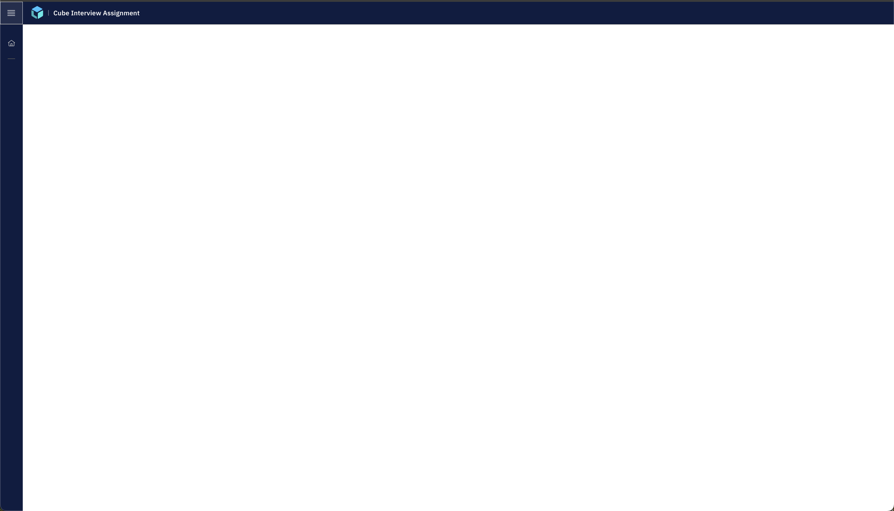

<h1>Cube Interview Assignment</h1>

Cube Interview Assignment details can be found [here](/ASSIGNMENT.md).

## Setup

## Setup

Please make sure your development env has met the following requirements before you start:

| Dependency |   Version   |
| ---------- | :---------: |
| Node       | >= v12.13.0 |
| YARN       | >= v1.22.19 |

## Quick Start

```bash
$ git clone git@github.com:bigstack-oss/interview-assignment.git
$ yarn
```

### Running app for development

```bash
$ yarn dev
```


Open browser with http://localhost:3001/



### Code linting

```bash
$ yarn lint 
or 
$ yarn lint:fix
```

## Assignment 
Read [ASSIGNMENT.md](./ASSIGNMENT.md) to get more about assignment details. 


## License

MIT
